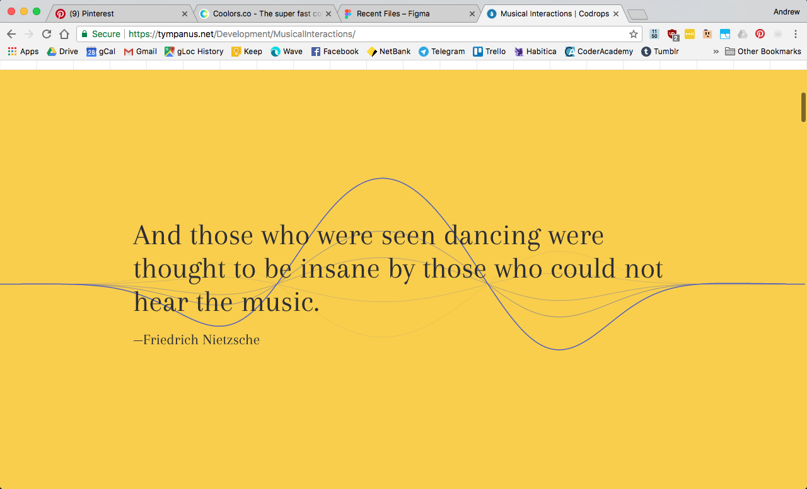
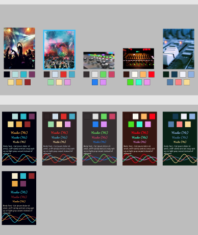
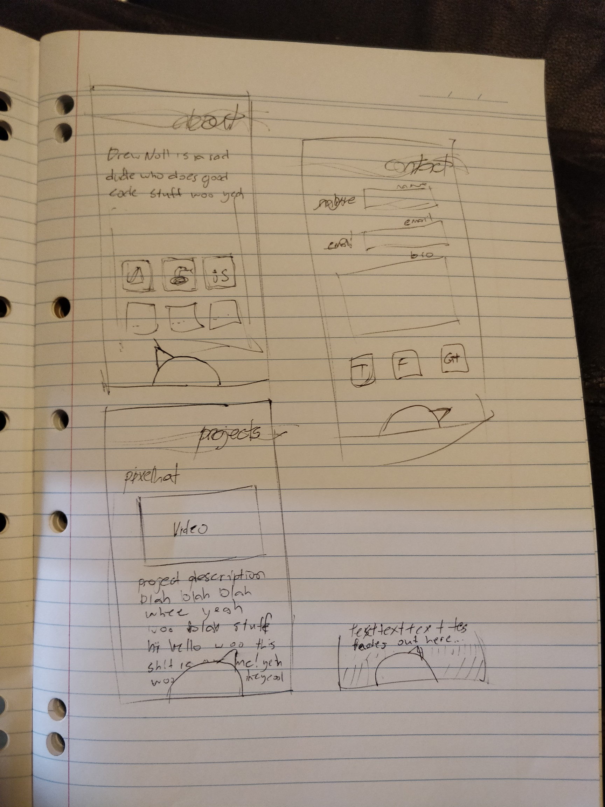

# Portfolio Project - drewnoll.netlify.com

      

## Overview

**Project: Coder Academy HTML & CSS Project (Portfolio)**

**Author: Drew Noll (drew@oheydrew.me)**

This is the Week 4 HTML & CSS Project for the Coder Academy Fast Track Bootcamp in 2018. We were tasked to build a personal portfolio website to showcase our projects and works, and market ourselves going forward. 

We were encouraged to use pure CSS and HTML elements, and not implement javascript at this point in time. We were to implement a full design process in Figma, and then move on to coding the HTML and CSS from scratch.

<br/>
<br/>

# Development Process & Documentation

## Design Process

## Concept & Mood board

Coming from a Live Audio background, I was concious of my story, my past, and how to tie it into my new career path. I didn't want to over-do it, but I thought some of the colours and imagery from this world of dark night concerts, and bright shining lights could make for an exciting vibe and feel. 

As I progressed through the design stage, I learned a lot about how images translate to their colours, and if I did it again, I might decide to do things differently, but as it stood, I started with a few key images.

Everything began with this image I took a few years back:


The dark colour mixed in with the bright, popping highlights gave me ideas. I started moving through to other images, and saved them to a [pinterest board](https://www.pinterest.com.au/oheydrew/portfolio-ideas/).


## The Sine Wave

Another key inspiration was a Sine Wave. Having found a lot of cool work online using the Web Audio API, I found a lot of excellent imagery around the simple **Sine Wave**. 


<br/>

[Link](https://tympanus.net/Development/MusicalInteractions/)

This image has a neat scrolling sine-wave effect, and was the basis for the inspiration.
<br/>

<br/>

<br/>

[Link](https://pudding.cool/2018/02/waveforms/)


This page is **awesome**. Using react and the Web Audio API, It has fully adjustable Sinewaves, interactivity, and general coolness. I would *love* to implement this kind of idea as a splash header, sometime.

This whole idea seemed perfect, to me, and I began to envision the splash-page I came up with. I knew it would be difficult to achieve with mathematical functions, and harder still without JS, and after looking into manually coding SVG's, I decided to put that into the *"I will learn this one day, but not today"* basket.

I thought about a movable, repeatable DIV using CSS Transform, and from there came the basis of the animating splash page, and a lot of the conceptual ideas concerning fonts, etc.

## Colorscheme and Typography

With these images in mind, I moved into Figma, to start to place colours. I also used [coolors.co](https://coolors.co/) to test colours and see if they matched, or find some alternatives.

I ran into *huge* issues here. It seemed that every image I used, every colour I sampled, they didn't seem to work out well in palette form. I struggled a lot with this process, and spent a long time trying to come to a decision on colour. 




As you can see, not many of these schemes were very exciting. I toyed a little with lighter themes, though admittedly, probably not enough. I found it was working best with less colours, and eventually settled on a few palettes, and mixed a few together, checking them.

<br/>

            
Some of the choice colour palettes I picked
<br/>

 
<br/>

I eventually decided to take a few of these key colours that I liked, and combine them with a greyscale palette. This seemed to work, with colours popping as I liked. I decided to move forward with this, at least through the design phase, intending to set colours as CSS3 Variables, ready to change if ready.

## Sketches

I also started thinking about navigation, initially thinking ov using a menu using a fader, or a knob that rotated. I worked these into my initial designs, and began to sketch some ideas into place.

  

Above: Initial ideas for side-sliding fader menu, and then attepts at "nav rotator" rotation knob.

  

With the rotation knob concept, I decided that it wouldn't be apparent that it was a menu, unless it were explicitly written. This restricted me (in mobile, at least), to placing it top, or bottom, for space for the word "menu". I began to play with bottom menu ideas, and then sketch rough layout designs.

## Figma design

**[Link to my Figma Design](https://www.figma.com/file/yMjJIzdxPgI7f0AvZPrluF/portfolio-v0.5)**


**Figma overview** - I began with colours on the left, and type. Moved through to the top right, working on layouts and iterating. Logos ended up in the centre, and the final design ideas came out at the bottom, including an alternative light colour theme.

<br>


**Color palette workspace** - (Note the first "manual" attempt on the bottom left. Euuugh! There's a learning, right there! :) )

<br>


**Font workspace** - Having decided on a "rotating knob" style menu, as well as the curved "sine wave" logo theme, I decided to choose a Hero Font in cursive, moving it through the themes for headers.

For the Body font, I wanted a nice, smooth Sans Serif, with rounded curves to match the wave of the sine, somewhat. I'm not sure whether my final decision reflected this, but it seemed to fit.

<br>


**Backgrounds** I toyed with backgrounds, thinking about the blur and bokeh of unfocussed light that comes so often in live music photography. In the end, I didn't have time to continue researching images and find the right one. This may be something I consider in the future, as the concept seemed a little promising. Ultimately, I scrapped it.

<br>


**Logo and Splash Vector Design.** I spent a long time in figma working on the idea and concepts for my logo and sinewave splash. Everything you see here is vectorized and created from scratch- (including the failed accidental "Coca Cola" logo, centre left :) ). In here I worked on my initial "rotating knob" design, as well as buttons and logo containers. Everything was eventually componentized for the layout phase, for easy manipulation- though I lost time, here, fiddling with details.

<br>


**Initial design concept** - Starting at the top left, I wanted to see various colour palettes at work. Once I decided on one workable palette, I moved into adding elements such as the splash logo, and the proposed menu system. 

The yellow colour scheme was a contender, but I decided to go with blue, with splashes of red for contrast. 

<br/>


**Initial design zoomed** - Eventually I locked this down and started iterating on various layout concepts. I wanted a smooth fade down below, again, going for the fading, sinewavey vibe for the project.

<br>


**Components** - I eventually locked down an idea (I'd spent too much time by now) and decided to create figma master components. This meant I could immediately change the look of my design at will, and try various colours and tweak things as I needed. I tried this with a yellow theme, as well as a white:

   

I didn't hate either: In fact, I was tempted to try it out in production using colour variables.

<br> 

## Final design


**Mobile**


**iPad**


**Desktop**

**Final design layouts** - Using components made mocking up my design relatively straightforward, but I spent far too long tweaking. I did iterations and tried adding separate sections, though a lot of these were lost due to figma's auto saving. In the end I found myself at a happy space and decided to move on into implementation.

## Design considerations / Concerns

### Menu Concerns / Alternates

I was aware that my "knob menu" would be difficult to implement. I wanted it to originally rotate to the currently scrolled section of the page, and I realised that this wouldn't be possible in pure CSS. This left me with some major design and implementation issues- and I had to start thinking about alternatives.

I chatted with my teachers prior to implementation and decided to create an alternative, popup menu system (and played once more with colours... a recurring theme)


**An alternative menu** - This was one concept, as well as the final idea of having a static menu along one edge. This came from the concept of a "Beat Pad" music creation tool - I wanted to bring feelings of modern music tools like Ableton Live and Beat Maker. 

<br/>

I ended up making a second, static, 4-buttons on the bottom mock up toward the early implementation process in CSS, in order to move forward, and this ended up being pretty similar to my final product.

### Colour concerns

The entire project I have not been sold on the colorscheme. I got to a point where it was very easy to change, and it's likely I will go back and recolour my CSS color variables after the fact. The lighter, less dark colour schemes were tempting at every stage. But as it stood, I needed to begin implementation.
<br/>
<br/>

# Development Implementation

## Development Planning

### Trello


I set about this with a very structured process, creating a trello board with Design, and Implementation To Do's, and I stuck to this throughout the process. It was *incredibly* helpful, and it managed to keep me on task during the implementation.

<br>

### Div Layout


I wanted to systematically structure this, beginning with a figma layout of my Divs, so I knew what containers to put where. Figma unintentionally helped a **lot** here, giving me a handy nested structure to work from, and I could use it to structure my content in HTML/CSS. **This step was invaluable!** I can't stress how important this was.

### HTML layout

I then went and decided how to structure my HTML tags and CSS classes, intending to keep things grouped and distributed. 

Toward the end, some of these intentions got a little blurred, but I benefited so much from taking the time to wireframe both my Div layout, and my HTML structure from the start.

### HTML/CSS Styling choices

I started out trying to implement the HTML5 tag structure- using **\<named tags\>** for blocks, and classes for styling them. 

```
<div class="container"> - was my main container wrapper at the whole viewport size, containing a flexbox to sit my navbar and main content inside.

    <nav> - Navbar @ bottom (eventually top)

    <main> - Content container
    
        <section> - Broke up my sections (or 'pages')

            <header> - Headings for each section
            <content> - Main text for each section
            <aside> - Images or icons for the content

<button> - Button containers, styled differntly with classes
```

This layout actually worked pretty well, allowing me to style elements directly as parents of their subclasses, and style the subclasses accordingly. 

There were a few outliers to this. Whilst making my "checkbox menu" prototype, a lot of this went out of the window in lieu of classes for each segment.

## What went well

### Structure of HTML/CSS
The structure worked really well. I rarely (if at all) got stuck in the div layout / structuring / page layout side of things. I had some minor issues with getting my background image behind the header (I learned a lot about importing SVG files and how they're a little different to work with than standard graphics), but aside from this, layout worked really well with flexbox, and media queries for responsiveness.

### Sine Wave Splash

When my design and content was locked in, I worked finally on my **Sine Wave Splash**, and I have to say, I am really happy with how that segment came out. It was how I envisioned it, and whilst there's a lot more that I could do with it, I would like to continue furter with it as a concept going forward. Possibilities are endless- I could work with the Web Audio API to make it responsive- have it slow or speed up with swiping, or change the orientation to vertical and have it slowly move behind floating block elements- it could even be interactive this way as long as it weren't too distracting. I'll be working with this, for sure.

### Coding speed / understanding

Once I got the hang of flexbox and divs, I found I got faster and faster at it. By the end of it, I had  solid grip on how things go together. Coupled with the design being laid out, it came together really quite quickly. I'm happy with the quality of the final product, even if I'm not happy with some design choices (ie, colour, and style).

### Responsiveness

It responds really well. I managed a few tricks with flexbox, as well as media queries, to get things displaying how I wanted them. Quite happy with how it responds.

<br/>

## Challenges / What Changed

### The Demise Of The Menu Knob :(
As you can see from the final website- the menu system was a huge challenge. Realising early in the implementation that detecting the scroll state / would be difficult without JS, I didn't feel like I'd be able to link the rotation of the menu knob to the scroll state of the page.

This in mind, I moved forward into implementation with a static bottom-aligned menu:


<br/>

This wasn't ideal. I didn't love it, and I still don't. The design is way off my original plan, and it doesn't fit the asthetic I was going for. But it works, it's solid, and it fulfils the purpose.

I also discovered a major issue with it being on the bottom- many phones move the viewport and place icons over the bottom edge of the screen, so I had to move this to the top. This is where it finally sat.

### Menu Alternatives

I also went through and made a hamburger-style 'hidden checkbox' css menu. If you'd like to see the implementation, you're welcome to check out the alternate site at [hamburger-index.html](hambuger-index.html).

In the end, with discussion from teachers, I decided a static, top aligned menu option was best. With more time, I'd work out how to get either my original design, or a better drop down menu choice happening.

## Where to from here

### Design

Design was my biggest struggle. From colour choice through to layout, I found it didn't come as naturally as I'd like. I plan to take some short design courses, learn more modern design techniques, as what I came up with feels dated, and needs some love. Possibly a whole new concept, or possibly just some colours.

Perhaps some colour changes from section to section- perhaps a subtle background image or two, perhaps some parallax. I've been really impressed by my class, and their results- and am choosing to take this as inspirational, rather than self-criticising. I can learn and do better, here.

I will also endeavour to get feedback earlier, I was too much of an island early on.

### Colours

I didn't like the colours, in the end. I thought dark would work, but I don't think it does. I think I'll try a light colour scheme - and thankfully, due to the CSS Variables and not too many images to restyle, it won't actually be hard to implement this. I plan to change it, in the immediate future, before I release this as my actual website.

### Fonts

I made choices regarding fonts early, based on the curly sine wave asthetic. As I moved forward, it became less focussed around that, and I feel like perhaps these cursive style fonts are my main design flaw. I need to take that back to the drawing board and really suss out what works with the wave, and what styles I should consider. Again, I will be doing this before launch.

### Menu

I'm quietly devastated that the menu didn't work out as I planned! I really would like to get one of my original implementations working, be it a fader, or a knob. It would be really on-brand. But perhaps with my talk of design, this is the wrong direction. I now know that I have the skills to implement whatever I like, I just need to decide what to do.

### Optimization / Compatibility

There were a few concerns with the way I implemented my scrolling SVG style splash menu, I think it might take too many resources to animate. I have intentions to look into this, get something cool happening, perhaps actually use a library to generate the wave directly.


# Final Thoughts

All in all, I had a good time designing and implementing this project, even if I am a little disappointed with the look of the end product. I've taken some learnings on board, and I'm excited to see what I can do next! :)